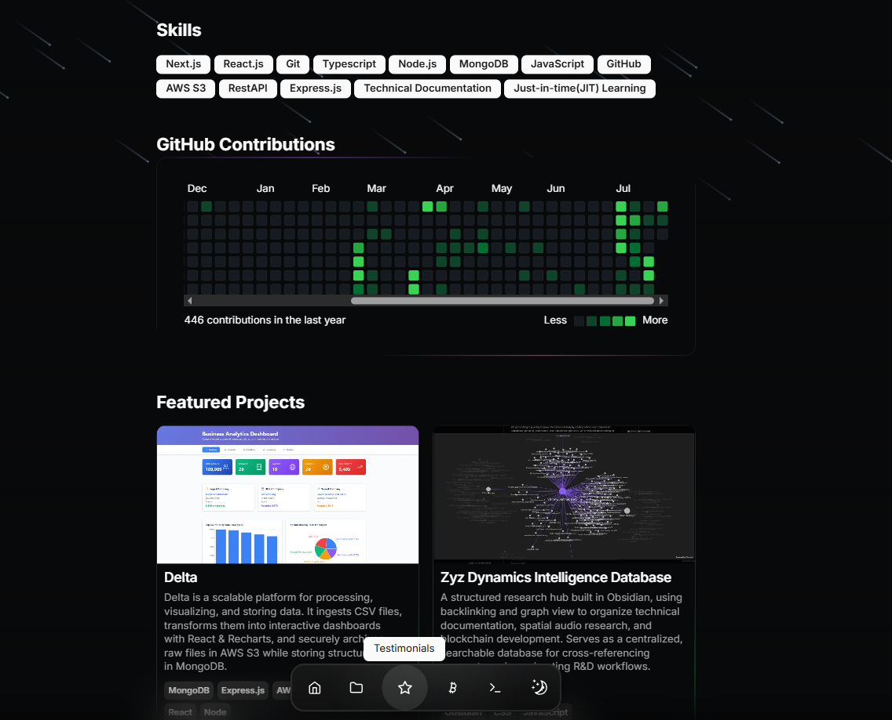
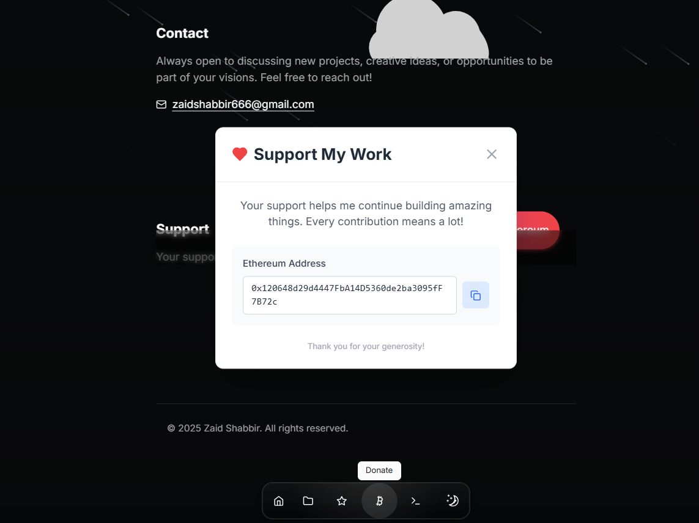

## Enhanced Portfolio 

A modern, responsive portfolio website originally created by @StarKnightt, extensively customized with testimonials system, donation functionality, and personalized branding. Built with Next.js 14, TypeScript, Tailwind CSS, and Framer Motion.

---

## Original Features 

* **Responsive Design:** Looks great on all devices
* **Dark/Light Mode:** Automatic theme switching based on system preferences
* **Animations:** Smooth page transitions and micro-interactions with Framer Motion
* **GitHub Integration:** Live GitHub contribution graph
* **SEO Optimized:** Meta tags and OpenGraph support
* **Performance Focused:** Optimized for Core Web Vitals

---

## My Enhancements & Modifications

* **Testimonials System:** Dedicated testimonials page with client reviews and feedback
  

* **Donations Integration:** Custom donation page with payment integration
  

* **Services Offered:** With a separate page, you can add pricing too!
  

* **Redesigned Layout:** Completely restructured UI to match personal branding

* **Streamlined Content:** Removed blog support, video gallery, and gadgets shop for focused experience

* **Custom Data Structure:** Modified `src/data/` files to support testimonials and donation features

* **Enhanced Mobile Experience:** Improved responsive design for testimonials and donation flows

---

## Tech Stack

* **Framework:** Next.js 14
* **Language:** TypeScript
* **Styling:** Tailwind CSS
* **UI Components:** shadcn/ui
* **Animations:** Framer Motion
* **Content:** Custom data structures (removed MDX dependency)
* **Deployment:** Vercel

---

## Modified Project Structure

```
 Modified Project Structure
├── public/           # Static assets
├── src/
│   ├── app/         # Next.js app router pages
│   │   ├── testimonials/  # New testimonials page
│   │   └── donate/        # donation button.
│   ├── components/  # React components (enhanced)
│   ├── data/        # Modified data files for testimonials
│   └── lib/         # Utility functions.
```

---

## Key Customizations

* **Testimonials Page:** Complete testimonials management with responsive cards and smooth animations
* **Donation Integration:** Secure payment processing with multiple donation options
* **Personal Branding:** Custom color scheme and typography matching personal brand
* **Simplified Navigation:** Focused user journey removing blog/video distractions

---

## Installation & Setup

Clone this enhanced version:

```
git clone https://github.com/zayd100/portfolio2.git
```

Install dependencies.

Customize testimonials in `src/data/testimonials.ts` and donation settings in `src/data/donation.ts`.

---

## Credits & Acknowledgments

* **Original Template:** @StarKnightt for the excellent portfolio foundation
* **UI Components:** shadcn/ui for beautiful, accessible components
* **Animations:** Framer Motion for smooth interactions
* **Styling:** Tailwind CSS for rapid development
* **Framework:** Next.js team for the amazing framework

---

## License

This enhanced version maintains the original MIT License. See LICENSE file for details.
